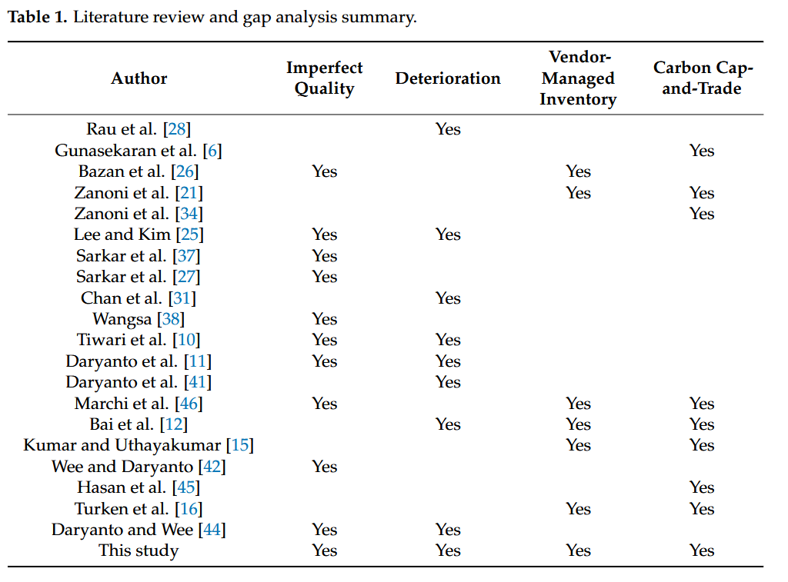

 

# Writing a Gap Analysis for Final-Year and Graduate Students

## **Introduction: Using Literature Review as a Gap Analysis**

A common challenge when starting a literature review is vague advice such as “read often, and read a lot,” which can lead to unfocused and inefficient use of time. To provide structure, this manual introduces the **gap analysis** approach, which transforms the literature review into a systematic process.

By conducting a gap analysis, you create a tangible output: a **gap analysis table**. This table visually captures the current state of the field (state of the art) and identifies areas for further research. It also helps guide your project development, especially in fields like engineering where creating practical outcomes is essential.

## **What Is a Gap Analysis Table?**

A gap analysis table organizes and summarizes existing work to highlight what has been done and what remains to be addressed. It uses two key dimensions:

1. **Vertical Axis (Left Column)**: Represents the body of related work.
   - This could include frameworks, methods, or studies that address similar problems to your project.
   - Examples: Research papers, frameworks, models, or industrial applications.
2. **Horizontal Axis (Top Row)**: Represents the features or factors under investigation.
   - These can take different forms:
     - **Binary** (e.g., “Yes” or “No” to indicate whether a feature is addressed).
     - **Categorical** (e.g., specific domains like Manufacturing, Mining, or Healthcare).
     - **Numerical Range** (e.g., operating temperature ranges such as “100-300°C”).

## **Steps to Create a Gap Analysis Table**

1. **Identify Related Work**:
   Collect studies, frameworks, or solutions related to your research area. List these along the vertical axis.
2. **Determine Features or Factors**:
   Decide on the key features or factors relevant to your project. These will form the horizontal axis.
3. **Populate the Table**:
   - For each related work, assess whether it addresses the features or factors.
   - Use binary indicators (e.g., Yes/No), categorical labels, or numerical ranges as appropriate.
4. **Analyse the Table**:
   - Highlight gaps by identifying features or factors not covered in existing work.
   - Use this analysis to refine your research focus, ensuring your project adds value by addressing these gaps.

------

## **Example of a Gap Analysis Table**

| **Related Work** | **Feature 1** | **Feature 2** | **Feature 3** | **Domain**    | **Range** |
| ---------------- | ------------- | ------------- | ------------- | ------------- | --------- |
| Framework A      | Yes           | No            | Yes           | Manufacturing | 50-100°C  |
| Framework B      | No            | Yes           | No            | Mining        | 100-200°C |
| Proposed Study   | Yes           | Yes           | Yes           | Healthcare    | 100-300°C |

This table demonstrates how your project:

1. **Shows Uniqueness**: It addresses features or combinations not covered by prior work.
2. **Captures the State of the Art**: It reviews existing frameworks and studies.
3. **Analyses Critical Features**: It systematically evaluates the features relevant to the problem.

------

## **Benefits of Using a Gap Analysis Table**

1. **Clarifies the Research Gap**: The visual format makes it easier to communicate the novelty of your study.
2. **Structures the Literature Review**: Helps organize the state of the art systematically.
3. **Guides Project Development**: Provides insights into key factors that should be addressed in your work.

##  Examples in literature

See below an example of gap analysis in published articles.

Table 1: Literature review and gap analysis summary [DOI: [10.3390/joitmc8010030](http://dx.doi.org/10.3390/joitmc8010030)]

 
