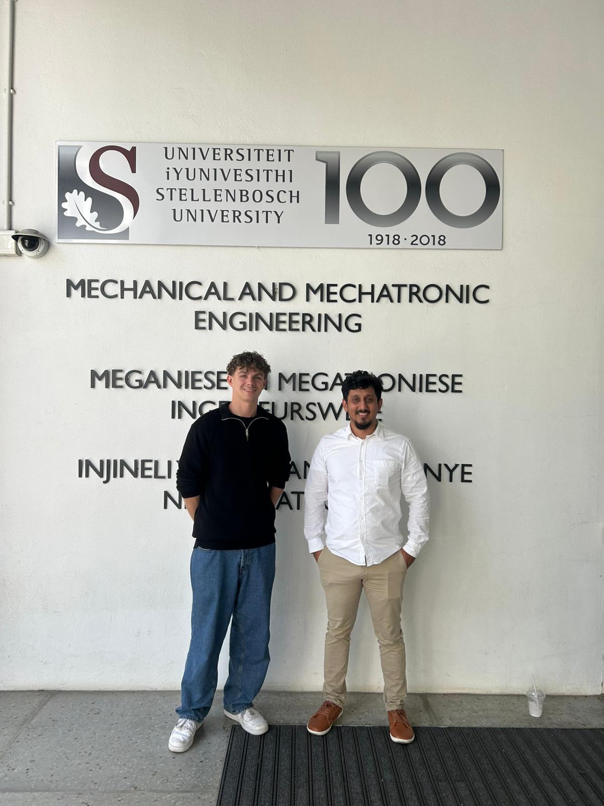

# Timo Dietrichs’s Research Stay Summary

**Duration:** 25 August – 26 March  
**Location:** Stellenbosch University & surrounding communities  

Timo  was a fourth year energy engineering student from [HSD](https://www.hs-duesseldorf.de/en) in Germany. He completed a 6 month research stay focused on sustainable energy solutions for underserved communities. His contribution is summarized in an academic paper titled [Design and Validation of Scalable Solar Home Systems for Energy Access in Rural Nano-Communities](./Timo Dietrich Paper.pdf) and [presentation](./Timo Dietrich presentation.pdf).

## Academic Project Work
During his stay, Timo:
- Designed, built, and installed **Solar Home Systems (SHS)** for underserved communities  
- Contributed to improving **energy access at a household level** through practical implementation  
- Gained hands-on experience in decentralized energy system deployment  

## Community Work
Timo actively engaged with the local community:
- Volunteered at a **soccer school in Kayamandi**, supporting youth development  
- Participated in community upliftment and cultural exchange activities  

## Reflection
Timo reflected positively on his experience, stating:

> “I learnt a lot in my stay.”

## Summary
Timo’s stay combined **technical impact and community engagement**, making it a meaningful and well-rounded experience.
## Academic Contribution
- Co-developed and contributed to an academic paper:  
  **"Design and Validation of Scalable Solar Home Systems for Energy Access in Rural Nano-Communities"** :contentReference[oaicite:0]{index=0}  
- Prepared and delivered a presentation based on his project work  

## Reflection
Timo reflected positively on his experience, stating:

> “I learnt a lot in my stay.”

