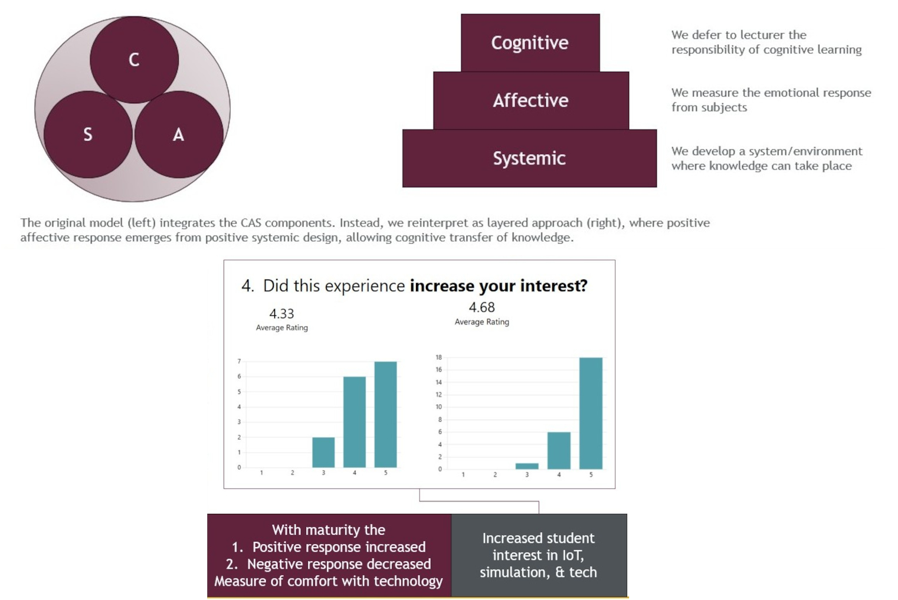
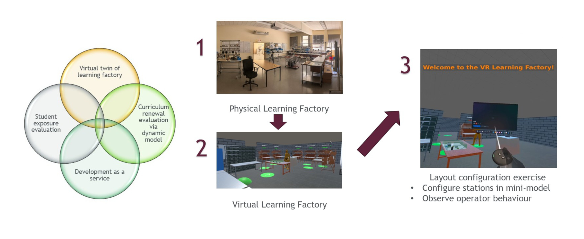
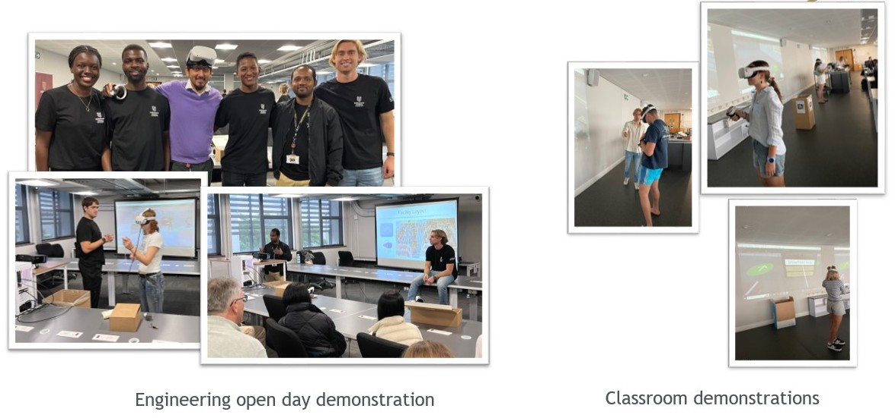

# Enhancing Engineering Education: Evaluating VR Integration and Student Affective Responses

**Background:** The affordability and accessibility of virtual reality (VR) technology are driving its increased use in education. While VR has the potential to enhance learning, it also presents challenges.

**Purpose:** This project aims to develop a VR-based classroom experiment to create supportive learning environments by fostering comfort with technology and assessing affective responses. It also contributes to a framework for sustainably integrating VR into engineering education through in-house development and multi-course employment.

**Method:** Third- and fourth-year engineering students participated in a VR facility layout exercise. Their emotional responses were measured using modified Positive and Negative Affect Scale (PANAS) surveys. The study focused on iterating the VR framework rather than immediate scientific inquiries.

**Findings:** Fourth-year students showed more positive and fewer negative emotional responses to VR compared to third-year students, indicating greater familiarity and comfort with the technology. The self-reporting method effectively gauged student comfort levels with VR.

**Implications:** The framework can:
- Compare affective responses between academic years.
- Evaluate responses to curriculum changes.
- Assess comfort levels across different socio-economic groups.

**Limitations:** While affective responses provide insight into the learning environment, they do not measure knowledge acquisition, which requires separate assessment. The relative nature of affective responses limits the value of quantifying a 'ground truth.'

**Social Impact:** The project advances education by integrating VR technology, enhancing technological literacy, and preparing students for a digital future. It also contributes to understanding the effectiveness of VR in education.

**Local Implications:** The project demonstrated VR's value in teaching and developed a framework for its sustainable inclusion in the Faculty of Engineering. It highlighted that the cost of VR systems is lower than expected and emphasized the value of student involvement in development. The PANAS framework will be used in long-term studies to assess the impact of technology comfort. This effort supports the Faculty of Engineering Virtual Reality User Area (FEVRUA) in expanding VR teaching across faculties.
