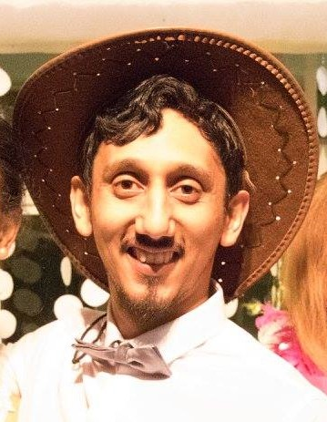

# About me

I am an engineering lecturer at the University of Stellenbosch, South Africa. 

My research investigating manufacturing systems spanning Mechanical, Mechatronic, and Industrial Engineering. I am currently investigating virtual prototyping and commissioning of manufacturing assembly systems. This typically takes the form of using simulation to develop factory applications. Two examples are (1) Intelligent industrial robot application, including communication and data acquisition, using in virtual/ simulated environments and (2) human assembly environments using virtual reality to simulate tasks, equipment, and system level intelligence.

I hold a Bachelors in Mechanical Engineering and a Masters in Mechatronic Engineering from Stellenbosch University, and a PhD in Mechanical Engineering from [UNIST](https://www.unist.ac.kr/), South Korea.

 

This is where I share my bright ideas. This is in no way an egotistical exercise, so if you don't like what I'm saying feel free to [contact-me](mailto:csteed@ieee.org) recommending any changes. 

If you would like to know more about me see my [Linked-in](https://www.linkedin.com/in/clint-steed/) or [ORCID](https://orcid.org/0000-0001-7338-3696) pages.

