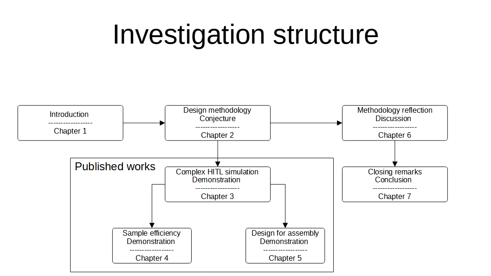

# Thesis structure

Implementing human-centric systems are difficult to quantify. After all how human-centric is a solution? This complexity arises from the interaction of socio-technical problems. Human's are highly adaptive to their environment therefore changing technical aspects of the system may result in behavioural change which change the system altogether. For example, in South Africa scheduled power cuts were employed to reduce electricity demand, resulting in rapid adoption of renewable energy and battery packs[]. These new technologies resulted in higher surges when returning/cutting power, ultimately damaging equipment, further increasing power cuts, resulting in an unstable feedback loop. This resembles our earlier reference to the cost of industrial farming[].

## Design science methodology

For this reason, design science research methodology was used here. Arising from Information sciences, where behavioural-science paradigm develops and verifies theories to predict behaviour. In the design-science paradigm, knowledge and understanding of a domain are achieved by developing an artefact [[Design science in systems research](https://dl.acm.org/doi/10.5555/2017212.2017217)]. This approach acknowledges that we experience science through artifacts and the two cannot be separated. Generally the artefact is a solution to a problem, can also be argued as an academic publication. It vaguely resembles the methods of complex systems simulation white boxing models to investigate emergent behaviour [Stephan wolfram]. 

While different processes of the design-science exist [[6-step](https://doi.org/10.2753/MIS0742-1222240302),[Three-cycle](https://aisel.aisnet.org/cgi/viewcontent.cgi?article=1017&context=sjis), [general-and-concrete-solution](https://doi.org/10.1057/ejis.2013.35), [FEDS](https://doi.org/10.1057/ejis.2014.36), [HENSOLT](https://doi.org/10.7166/30-4-2191)]. These appear to be variants describing three distinct characteristics. Firstly, novelty/innovation without which process is simply design. Secondly,  relevance - identifying research requirements and acceptance criteria. Thirdly, rigor and improvement. Concretizing this with the modern AI methodology it would be (1) formulating  a problem as a benchmark, selecting comparison metrics, then illustrating algorithm improvement.

## Investigation structure

In our investigation we take a general systems approach where "a law must be demonstrated on at least two independent systems" [Weinberg]. Therefore, we demonstrate our idea through two independent problems, the develop human-centric assembly stations using virutal reality. These chapters follow the following logic.

1. We begin with relevance, identifying the needs of future systems based on literature. These include (1) investigations affecting the adoption and adaption of systems to human-centricity [Leitao], (2) economic agenda's describing future needs like in Industry 5.0 and EU-SGDs, and (3) perspectives interpreting these future needs [Lithui]. Synthesizing the requirements from literature leads to perspective on what human-centric solutions look like.

2. The problems selected are inspired by recent research and involve currently maturing technologies (deep learning and Additive manufacturing) in order to illustrate the novelty of this work. These insure a higher chance of novelty/uniqueness.  
3. We do not consider rigor or improvement. While we are convinced that using other algorithms will improve the performance of these systems it is outside the scope of this work. We do acknowledge the ability to improve performance through systematically separating components, prioritizing virtual design iteration, and .

Chapter 3 builds on these novel implementations as demonstrations. It illustrates the general human performance data can be measured from the virutal workstations. It validates the measurements against well established models and illustrates that novel insights can be achieved by enriching existing models. This again illustrates using the design science approach of gaining knowledge based on artefacts and insights gained from prior artefacts.

Chapter 2 then provides a vocabulary for implementing human-centric data-driven systems as a conjecture. It can be applied more generally but acknowledges the cost of human labour in these simulations as an ethical constraint. Chapter 6 reflects the implementations (3,4,5) through the lens initially proposed (2), bringing to conclusion the investigation (6).

 
